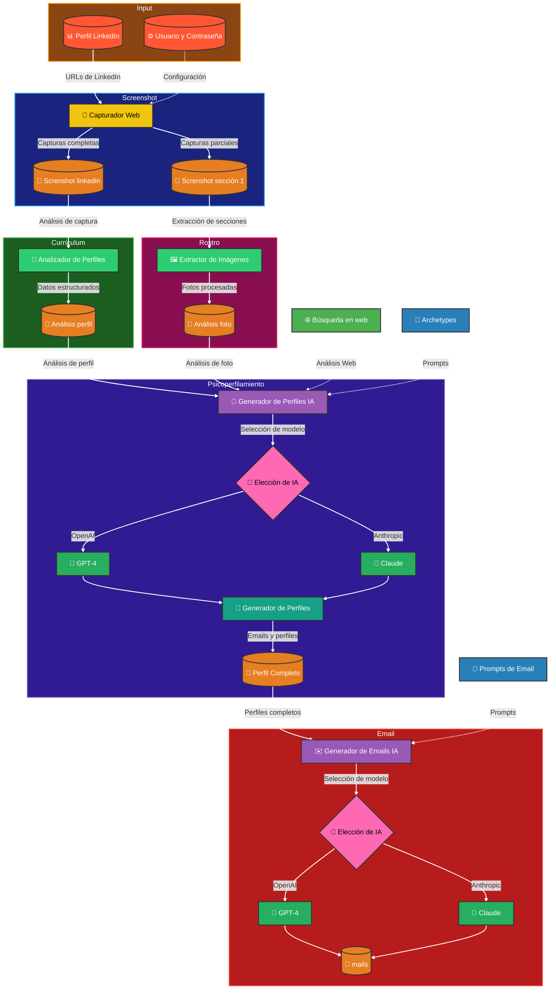

# AInstein LinkedIn Analyzer y Generador de Emails

AInstein LinkedIn Analyzer es una herramienta potente que automatiza el proceso de extracción, análisis y generación de emails personalizados a partir de perfiles de LinkedIn. Este proyecto aprovecha los últimos avances en web scraping, procesamiento de lenguaje natural e inteligencia artificial para proporcionar una solución integral para empresas que buscan mejorar sus esfuerzos de alcance en LinkedIn.



## Características

- **Scraping de Perfiles de LinkedIn**: Extrae automáticamente datos de perfiles de LinkedIn, incluyendo texto, imágenes y otra información relevante.
- **Análisis de Perfiles**: Analiza los datos extraídos del perfil para generar insights detallados sobre cada individuo.
- **Generación de Emails con IA**: Utiliza modelos de lenguaje avanzados (OpenAI y Anthropic) para generar emails personalizados y persuasivos basados en el análisis del perfil.
- **Flujo de Trabajo Automatizado**: Optimiza todo el proceso, desde la extracción del perfil hasta la generación del email, para ahorrar tiempo y mejorar la eficiencia.

## Arquitectura del Sistema

AInstein LinkedIn Analyzer se compone de los siguientes componentes principales:

1. **LinkedIn Scraper**: Responsable de extraer datos de perfiles de LinkedIn, incluyendo la captura de screenshots y extracción de texto.
2. **Extractor de Imágenes de Perfil**: Procesa las imágenes de perfil extraídas y las prepara para un análisis posterior.
3. **Analizador de Perfiles**: Analiza los datos extraídos del perfil y genera información estructurada sobre cada individuo.
4. **Generador de Perfiles con IA**: Aprovecha los datos del perfil y las imágenes para generar un análisis detallado utilizando modelos de IA.
5. **Generador de Emails con IA**: Genera emails personalizados basados en el análisis del perfil impulsado por IA.

## Comenzando

Para comenzar con AInstein LinkedIn Analyzer, sigue estos pasos:

1. Clona el repositorio:
   ```
   git clone https://github.com/tu-usuario/ainstein-linkedin-analyzer.git
   ```
2. Instala las dependencias requeridas:
   ```
   pip install -r requirements.txt
   ```
3. Configura las variables de entorno en un archivo `.env`:
   ```
   OPENAI_API_KEY=tu_clave_api_de_openai
   ANTHROPIC_API_KEY=tu_clave_api_de_anthropic
   ```
4. Prepara tus datos de entrada (URLs de perfiles de LinkedIn) en un archivo Excel llamado `prueba_url.xlsx`.
5. Ejecuta el script principal:
   ```
   python linkedin_scraper.py
   ```
6. Procesa los perfiles extraídos:
   ```
   python linkedin_profile_analyzer.py
   ```
7. Genera perfiles completos con IA:
   ```
   python ai_profile_generator.py
   ```
8. Genera emails personalizados:
   ```
   python mails.py
   ```
9. Los emails generados se guardarán en la carpeta `mails`.

## Configuración

La configuración del proyecto se gestiona a través de los siguientes archivos:

- `config.py`: Define las rutas, tiempos de espera y otras configuraciones.
- `models.py`: Especifica los modelos de IA disponibles para el análisis de perfiles y la generación de emails.
- `prompt_profile.py`: Establece los prompts utilizados para el análisis de perfiles.
- `prompt_email.py`: Define los prompts utilizados para la generación de emails.

## Estructura del Proyecto

```
ainstein-linkedin-analyzer/
│
├── linkedin_scraper.py
├── linkedin_profile_analyzer.py
├── linkedin_profile_image_extractor.py
├── ai_profile_generator.py
├── mails.py
├── config.py
├── models.py
├── prompt_profile.py
├── prompt_email.py
├── requirements.txt
├── README.md
│
├── capturas_linkedin/
├── captura_1/
├── profile_photos/
├── json_profiles/
├── perfiles_completos/
└── mails/
```

## Contribuciones

Agradecemos las contribuciones al proyecto AInstein LinkedIn Analyzer. Si encuentras algún problema o tienes sugerencias para mejoras, no dudes en enviar un pull request o abrir un issue en el repositorio de GitHub.

## Licencia

Este proyecto está licenciado bajo la [Licencia MIT](LICENSE).

## Advertencia

El uso de este software para scraping y análisis de perfiles de LinkedIn debe cumplir con los términos de servicio de LinkedIn y las leyes de privacidad aplicables. Asegúrate de tener los permisos necesarios antes de utilizar esta herramienta.
