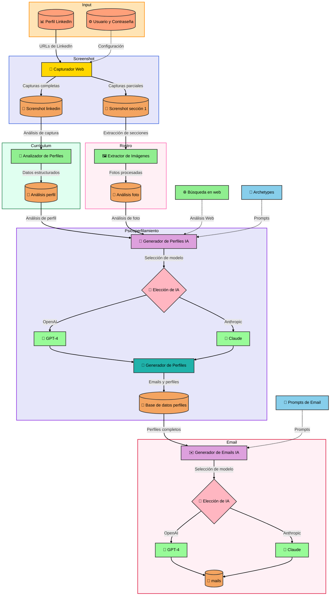

# Psycho-profiling agent

Psicoperfilamiento es una herramienta potente que automatiza el proceso de extracción, análisis y generación de emails personalizados a partir de perfiles de LinkedIn. Este proyecto aprovecha los últimos avances en web scraping, procesamiento de lenguaje natural e inteligencia artificial para proporcionar una solución integral para empresas que buscan mejorar sus esfuerzos de alcance en LinkedIn.



## Características 

- **Scraping de Perfiles de LinkedIn**: Extrae automáticamente datos de perfiles de LinkedIn, incluyendo texto, imágenes y otra información relevante.
- **Análisis de Perfiles**: Analiza los datos extraídos del perfil para generar insights detallados sobre cada individuo.
- **Generación de Emails con IA**: Utiliza modelos de lenguaje avanzados (OpenAI y Anthropic) para generar emails personalizados y persuasivos basados en el análisis del perfil.
- **Flujo de Trabajo Automatizado**: Optimiza todo el proceso, desde la extracción del perfil hasta la generación del email, para ahorrar tiempo y mejorar la eficiencia.

## Arquitectura del Sistema
  
AInstein LinkedIn Analyzer se compone de los siguientes componentes principales:

1. **LinkedIn Scraper**: Responsable de extraer datos de perfiles de LinkedIn, incluyendo la captura de screenshots y extracción de texto.
2. **Extractor de Imágenes de Perfil**: Procesa las imágenes de perfil extraídas y las prepara para un análisis posterior.
3. **Analizador de Perfiles**: Analiza los datos extraídos del perfil y genera información estructurada sobre cada individuo.
4. **Generador de Perfiles con IA**: Aprovecha los datos del perfil y las imágenes para generar un análisis detallado utilizando modelos de IA.
5. **Generador de Emails con IA**: Genera emails personalizados basados en el análisis del perfil impulsado por IA.

## Comenzando 

Para comenzar con AInstein LinkedIn Analyzer, sigue estos pasos:

1. Clona el repositorio:

   ```
   git clone https://github.com/tu-usuario/ainstein-linkedin-analyzer.git
   ``` 

2. Instala las dependencias requeridas:

   ```
   pip install -r requirements.txt
   ```
  
3. Instala Tesseract OCR en tu sistema. Las instrucciones varían según el sistema operativo:
   - Windows: Descarga e instala desde https://github.com/UB-Mannheim/tesseract/wiki
   - macOS: `brew install tesseract`
   - Linux: `sudo apt-get install tesseract-ocr`

4. Configura las variables de entorno en un archivo `.env`:

   ```
   OPENAI_API_KEY=tu_clave_api_de_openai
   ANTHROPIC_API_KEY=tu_clave_api_de_anthropic
   ```
  
5. Prepara tus datos de entrada:
   - Crea un archivo Excel llamado `prueba_url.xlsx` con una columna 'URL' que contenga las URLs de los perfiles de LinkedIn a analizar.
   - Asegúrate de tener las credenciales de LinkedIn necesarias para el scraping.

6. Configura las rutas en `config.py`:
   - Ajusta `CHROME_PROFILE_PATH` para que apunte a tu perfil de Chrome temporal.
   - Ajusta `EXTENSION_PATH` para que apunte a la ubicación de tu extensión de Chrome (si es necesaria). 

7. Asegúrate de que las siguientes carpetas existan en el directorio del proyecto:
   - `capturas_linkedin`
   - `captura_1`
   - `profile_photos`
   - `json_profiles`
   - `web_search_results`
   - `perfiles_completos`
   - `mails`
  
8. Ejecuta el script principal:

   ```
   python app.py
   ```

9. Sigue las instrucciones en la consola para seleccionar el tipo de modelo (OpenAI o Anthropic) y el modelo específico que deseas utilizar.  
10. El script ejecutará automáticamente todos los pasos del proceso:
    - Scraping de perfiles de LinkedIn
    - Extracción y procesamiento de imágenes de perfil
    - Análisis de perfiles de LinkedIn
    - Búsqueda web de información adicional
    - Análisis de resultados de búsqueda web
    - Generación de perfiles completos con IA
    - Generación de emails personalizados
   
11. Los resultados se guardarán en las carpetas correspondientes mencionadas en el paso 7.

Nota: Asegúrate de tener suficiente espacio en disco y una conexión a internet estable, ya que el proceso puede tardar dependiendo del número de perfiles a analizar.

## Configuración
  
La configuración del proyecto se gestiona a través de los siguientes archivos:

- `config.py`: Define las rutas, tiempos de espera y otras configuraciones.
- `models.py`: Especifica los modelos de IA disponibles para el análisis de perfiles y la generación de emails.
- `prompt_profile.py`: Establece los prompts utilizados para el análisis de perfiles.
- `prompt_email.py`: Define los prompts utilizados para la generación de emails.

## Estructura del Proyecto

```
ainstein-linkedin-analyzer/

│

├── linkedin_scraper.py

├── linkedin_profile_analyzer.py

├── linkedin_profile_image_extractor.py

├── ai_profile_generator.py

├── mails.py

├── config.py

├── models.py

├── prompt_profile.py

├── prompt_email.py

├── requirements.txt

├── README.md

│

├── capturas_linkedin/

├── captura_1/

├── profile_photos/

├── json_profiles/

├── perfiles_completos/

└── mails/

```

## Contribuciones

Agradecemos las contribuciones al proyecto Psicoperfilamiento. Si encuentras algún problema o tienes sugerencias para mejoras, no dudes en enviar un pull request o abrir un issue en el repositorio de GitHub.

## Contribuciones

Agradecemos las contribuciones al proyecto Psicoperfilamiento. Si encuentras algún problema o tienes sugerencias para mejoras, no dudes en enviar un pull request o abrir un issue en el repositorio de GitHub.

## Licencia

Este proyecto está licenciado bajo la [Licencia MIT](LICENSE).

## Advertencia

El uso de este software para scraping y análisis de perfiles de LinkedIn debe cumplir con los términos de servicio de LinkedIn y las leyes de privacidad aplicables. Asegúrate de tener los permisos necesarios antes de utilizar esta herramienta.
